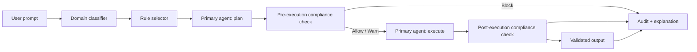

# Compliance Guardian

A research-driven guardrail layer for LLM and agent workflows. Compliance Guardian evaluates a request before execution, applies domain-specific rules, validates the generated output, and records an auditable explanation of the decision.

The project was developed as part of an MSc research project on trustworthy AI and focuses on a practical question: **how can an AI system enforce explicit governance rules without hiding the decision process inside the model?**

## What it does



The system separates task execution from compliance enforcement. Rules are explicit, inspectable and domain-specific, while the LLM is used as part of the reasoning pipeline rather than as the sole source of policy.

## Current capabilities

- **Domain classification** using keyword-based and LLM-backed routing.
- **Dynamic rule selection** with domain rule packs and hot reloading through `watchdog`.
- **Plan-stage guardrails** that inspect an intended action before execution.
- **Output-stage guardrails** that validate the generated result before it is returned.
- **Structured decisions and risk scoring** using Pydantic models.
- **Audit logging** with rule hits, explanations and governance reports.
- **OpenAI and Gemini support** for model-backed stages of the pipeline.
- **Multilingual explanations** for audit and governance outputs.
- **CLI, evaluation harness and demo tooling** for repeatable experiments.
- **Security and privacy documentation** covering the threat model and handling assumptions.

## Domain rule packs

The repository currently includes configurable rules for:

- Finance
- Medical workflows
- Web scraping
- Generic AI usage

Rules are stored as JSON under `compliance_guardian/config/rules/`. Each rule can include a description, prescribed action, legal or policy reference and user-facing guidance. Lightweight summaries are generated separately so the model receives only the context it needs.

## Tech stack

- Python 3.12
- Pydantic
- LangChain
- OpenAI / Gemini
- Typer
- Streamlit
- Watchdog
- Pytest
- mypy / flake8
- Sphinx

## Repository structure

```text
compliance_guardian/
  agents/                 Domain classification, planning and compliance agents
  config/rules/           Full domain-specific rule definitions
  config/rules_summary/   Reduced rule context for LLM calls
  datasets/               Evaluation scenarios
  logs/                   Runtime audit logs
  reports/                Governance reports
  ui/                     UI-facing pipeline helpers

docs/                     Sphinx documentation
notebooks/                Interactive demo material
tests/                    Unit and pipeline-focused tests
main.py                   CLI entry point
eval.py                   Evaluation harness
run_all.py                End-to-end execution helper
export_appendix.py         Research/report export utility
```

## Quick start

### 1. Install

```bash
python -m venv .venv
source .venv/bin/activate   # Windows: .venv\Scripts\activate
pip install -r requirements.txt
```

### 2. Configure a model provider

Copy `.env.example` and provide the credentials required by the provider you want to use.

### 3. Run a prompt

```bash
python main.py run \
  --prompt "Scrape article titles from example.com" \
  --session-id demo
```

Audit records and governance outputs are written to the repository's log/report directories.

## Evaluation and testing

The project includes an evaluation harness and a test suite covering core components such as:

- domain classification
- rule selection
- compliance decisions
- output validation
- risk scoring
- audit logging
- retry limits
- model/provider configuration
- structured models and JSON rule files

Run the checks with:

```bash
flake8
mypy compliance_guardian
pytest -q
python eval.py
```

The evaluation scenarios are stored under `compliance_guardian/datasets/` and are designed to make guardrail behaviour inspectable rather than relying only on subjective model outputs.

## Adding a new compliance domain

Add a JSON file under:

```text
compliance_guardian/config/rules/<domain>.json
```

The `RuleSelector` loads domain rules dynamically. Summary files used for compact LLM context can be regenerated with:

```bash
python scripts/generate_rules_summary.py
```

## Documentation

Sphinx documentation can be built locally with:

```bash
cd docs
sphinx-build -b html . _build
```

Additional repository documentation includes `SECURITY.md` and `PRIVACY.md`.

## Roadmap

The current repository is a research prototype. The next engineering steps are intentionally separated from the capabilities above:

- model the orchestration explicitly as a **LangGraph state machine** with conditional BLOCK / WARN / ALLOW paths
- add CI-backed linting, type checking, tests and real coverage reporting
- expand adversarial evaluation for prompt injection, jailbreaks and conflicting rules
- improve provider abstraction so model backends can be swapped without changing governance logic
- add richer evaluation summaries for false positives, false negatives, latency and model-to-model variance
- package the guardrail layer behind a clean API for easier integration with external agent systems

## Research context

This repository explores **governance as an explicit software layer around an AI system**. The aim is not to make an LLM responsible for interpreting every policy from scratch, but to combine structured rules, model reasoning, pre/post execution checks and auditable outputs in one pipeline.

External datasets referenced by the research include PrivacyQA, Anthropic HH-RLHF and OPP-115. Legal and policy references in the example rule packs are included for traceability and experimentation.

## Disclaimer

This project is a research prototype. The included rule packs are examples for experimentation and are not legal, medical, financial or regulatory advice.